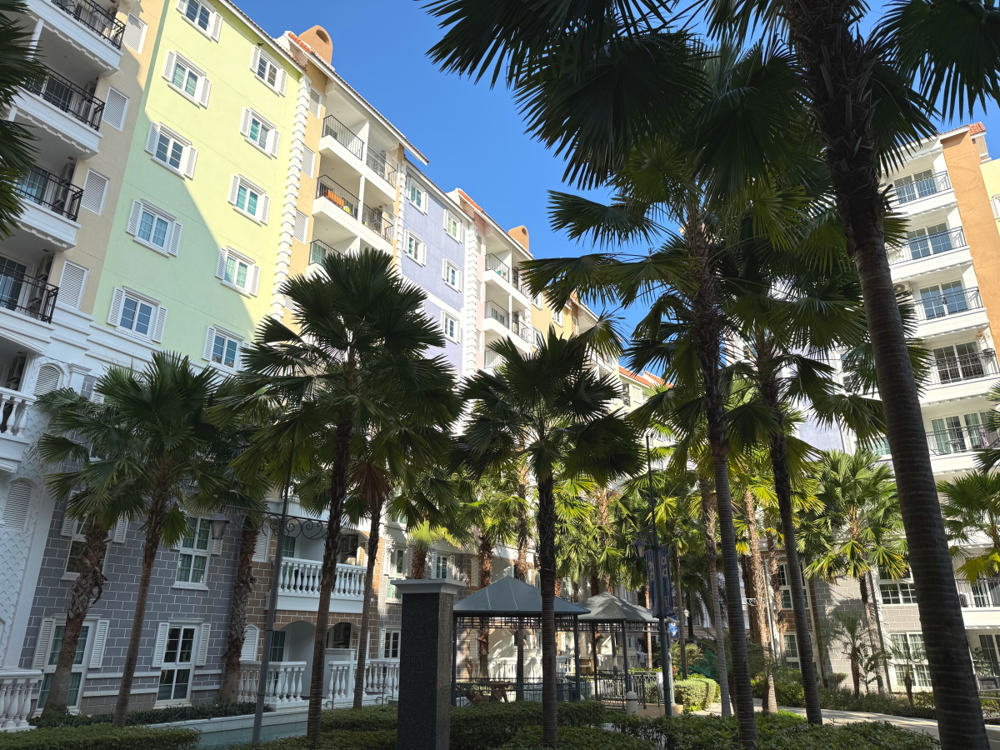
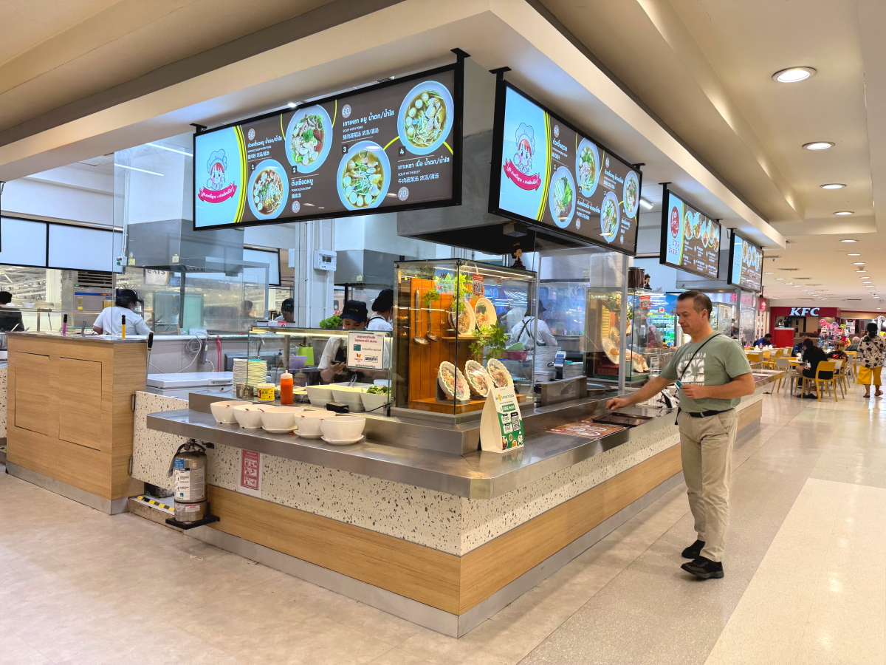
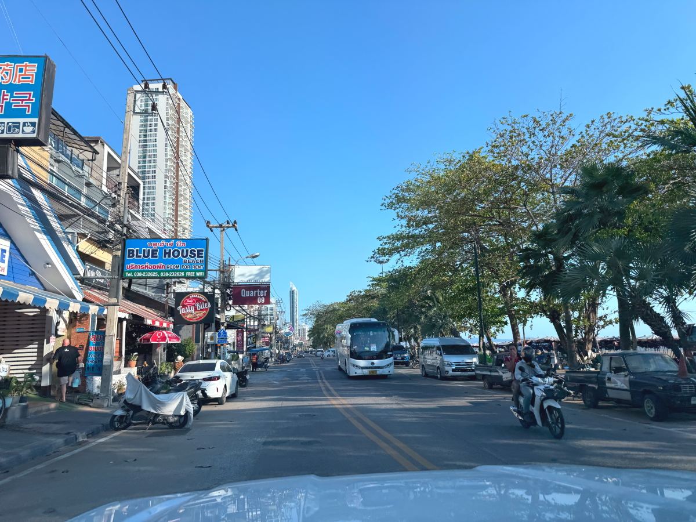
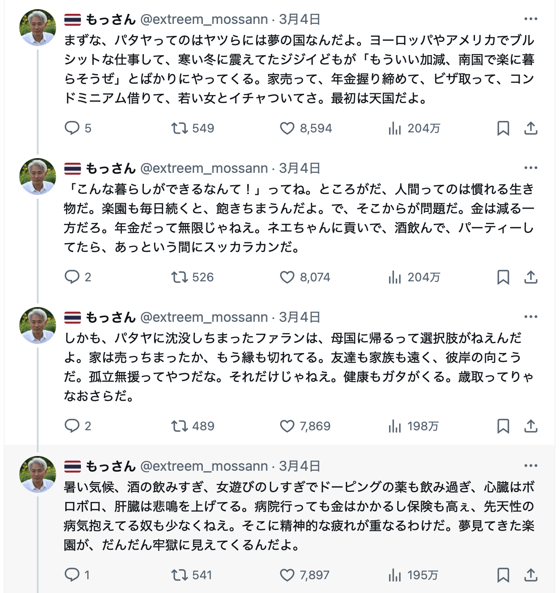

# 20250305_phattaya

<html>
<head>

<meta charset="UTF-8">
<meta http-equiv="Content-Type" content="text/html; charset=UTF-8">
<meta http-equiv="X-UA-Compatible" content="IE=EmulateIE10" />
<meta http-equiv="X-UA-Compatible" content="IE=edge">

<meta name="viewport" content="width=device-width, initial-scale=1.0">

<!--ここから上はお決まりの定型文です-->

<!--ここからが表現の書式などを決めるcssという部分-->

<link href="https://cdnjs.cloudflare.com/ajax/libs/lightbox2/2.7.1/css/lightbox.css" rel="stylesheet">

</head>

<body>

モバイル端末をお使いの場合は、画面を横向きにすると
より見やすくご覧頂けます。

<!--ここ上は、ほぼそのまま使います！-->

<!--QRコードの挿入例-->

 アクセス用QRコード

<marquee direction="left" scrollamount="20" width="30%">(^_^)/~alis</marquee>

<!--流れ文字の挿入例-->
<h1><marquee behavior="left">!!! 2025/03/05、パタヤ5日目は市内のショッピングモール!!!</marquee></h1>

                          

<!--ここから下が、本体部分-->

<h2>熱帯の朝は今日も快晴</h2>

    
<h2>軽くフィットネスで目覚まし</h2>

    
<h2>市内のちょっとした路地にロボットのオブジェ</h2>

    
<h2>ショッピングモールのフードコートで遅いお昼</h2>

    
<h2>食器の熱湯消毒システム</h2>

    
<h2>１階に広がる店舗は広大</h2>

    
<h2>お昼は軽くラーメン</h2>

    
<h2>子供の遊び場もなかなかの広さ</h2>

    
<h2>近の販売店が2軒並びます</h2>

    
<h2>ガラケーの中古品</h2>

    
<h2>デザートはこちらでスイーツ</h2>

    
<h2>女子高生の下校担当はお父さん</h2>

    
<h2>仏壇の横でBMWのチューンナップ</h2>

    
<h2>海辺に向かって、海沿いを戻ります</h2>

    
<h2>海辺を遊覧船が走ります</h2>

<h2>パタヤで宿泊した宿の全体像</h2>

    
<h2>宿泊した部屋は帆船模型の前</h2>

<h2>最後にパタヤに関するXでの記述があったので参考までに載せます 街を歩くとこれに該当しそうなお方も見受けられますが、ほとんどは小さな子供連れのヤングファミリーですね 画像クリックでXの投稿に飛びます↓</h2>

<!--   
  
<h2>今日のBGMは 移動で疲れたので癒し系 【120万再生感謝🌙】聴き流すだけで奇跡が起きる… 月のカノン</h2>
<iframe width="560" height="315" src="https://www.youtube.com/embed/lJxdEHg9cqA?si=6vr6iynbUdvMm-gF" title="YouTube video player" frameborder="0" allow="accelerometer; autoplay; clipboard-write; encrypted-media; gyroscope; picture-in-picture; web-share" referrerpolicy="strict-origin-when-cross-origin" allowfullscreen></iframe> 
-->

<!--
  
<h2>メタバース「cluster」内のイベントで「雪の約束」by まいてゃさん ダンサーの玖遠さんがトラブってみんなでステージダンスになりました</h2>
  
        <h2>MP4ファイルの再生</h2>
    <video controls width="640">
        <source src="2025-02-26 yukinoyakusoku by maitiya.mp4" type="video/mp4">
        お使いのブラウザは video タグをサポートしていません。
    </video>
-->

  
<h2>まいてゃさんアルバム MBG 2502 10kyoku 再掲です</h2>
<iframe width="560" height="315" src="https://www.youtube.com/embed/xVTSe-eXbFs?si=1YAnLelZqsU-zs0m" title="YouTube video player" frameborder="0" allow="accelerometer; autoplay; clipboard-write; encrypted-media; gyroscope; picture-in-picture; web-share" referrerpolicy="strict-origin-when-cross-origin" allowfullscreen></iframe> 
    
    
    <h3>「雪の中で輝くシンデレラ」by まいてゃ</h3>
<h2><a href="https://torokoid.github.io/20250219_chiangrai/maitiyaz.mp3" target="_blank">この文字クリックで再生します 下の再生ボタンでも同じ曲をループ再生します</a></h2>

    <audio controls loop>
        <source src="https://torokoid.github.io/20250219_chiangrai/maitiyaz.mp3" type="audio/mpeg">
        お使いのブラウザは audio タグをサポートしていません。
    </audio>

    
<!--
  
<h2>スティーブ・ジョブズの伝説の講義</h2> 
<iframe width="560" height="315" src="https://www.youtube.com/embed/XsRpvWHIVw0?si=f7IA0pv9iZWVk3VH" title="YouTube video player" frameborder="0" allow="accelerometer; autoplay; clipboard-write; encrypted-media; gyroscope; picture-in-picture; web-share" referrerpolicy="strict-origin-when-cross-origin" allowfullscreen></iframe>    
    
    
<h2>スティーブ・ジョブズ氏の講義の内容が「笑って死ぬ」by まいてゃ さんの歌の内容と大筋で同じに聞こえます 以下に再掲しますね</h2>

    
<h3>歌の後半部分しか撮れてませんが、2月16日のイベントで公開された「笑って死ぬ」 by まいてゃ 白ドレスはダンサーの玖遠さん、黒いドレスがまいてゃさん</h3>
<iframe width="560" height="315" src="https://www.youtube.com/embed/s4ZcbxAluMM?si=Xa32xo19UCNaWv0v" title="YouTube video player" frameborder="0" allow="accelerometer; autoplay; clipboard-write; encrypted-media; gyroscope; picture-in-picture; web-share" referrerpolicy="strict-origin-when-cross-origin" allowfullscreen></iframe> 
-->
    

    <h3>お気に入りの「笑って死ぬ」 by まいてゃさんも再々掲です</h3>
<h2><a href="https://torokoid.github.io/20250221_chiangrai/maitiya3.mp3" target="_blank">この文字クリックで再生します 下の再生ボタンで同じ曲をループ再生します</a></h2>

    <audio controls loop>
        <source src="https://torokoid.github.io/20250221_chiangrai/maitiya3.mp3" type="audio/mpeg">
        お使いのブラウザは audio タグをサポートしていません。
    </audio>

   
<h2>以上、パタヤ5日目はショッピングモールの昼食でした。 ここまでご覧いただきありがとうございました。</h2>

     
<h2>
<a href="https://torokoid.github.io/20241126_chiangrai/" target="_blank">Back to the menu page</a>
</h2>

   

         

  

      

<!--本体はここまで-->

<!--画面に空白地帯を作って、背景が見えるようにしています-->
                                              

<!-- フッタ -->
<footer>

Copyright 2025/03/05 alis @ChiangRai

</footer>

<!--HPにさまざまなJavaScriptを呼び込むための書式-->

    
    </body>
    
</html>
